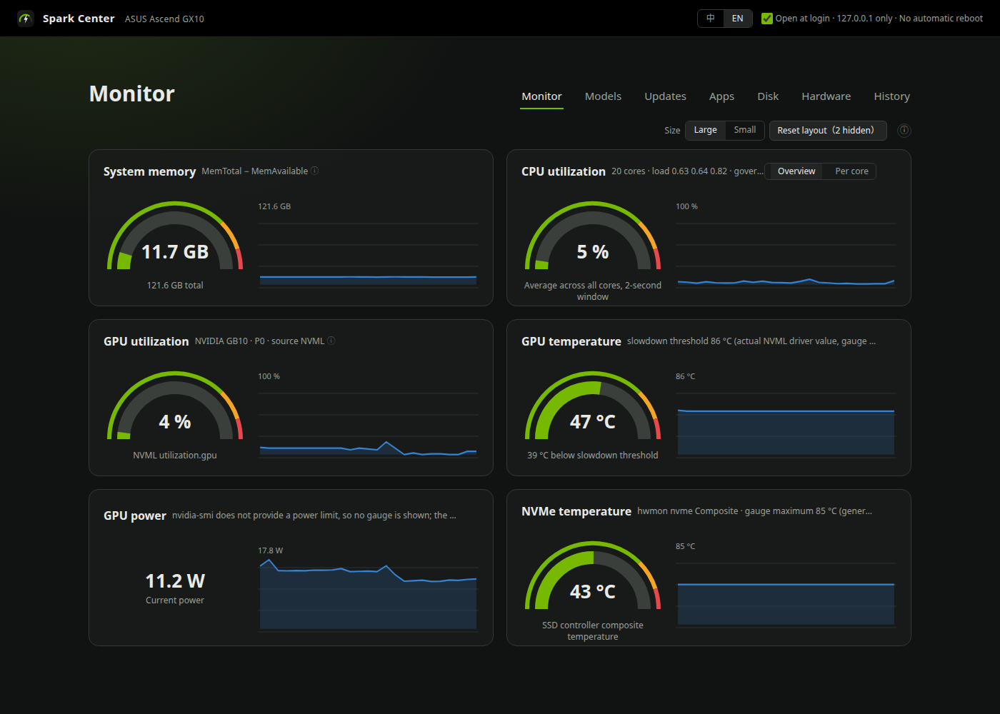
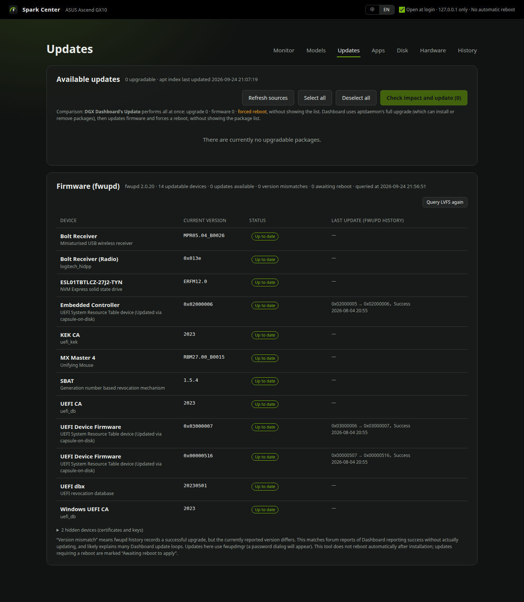

# Spark Center

**A local control panel for NVIDIA GB10 machines** — DGX Spark, ASUS Ascent GX10, and the Dell / HP / Gigabyte / Acer variants.
Updates, monitoring, LLM management, disk analysis and a hardware inventory, in one page that binds to `127.0.0.1` and never reboots your machine on its own.

> UI is bilingual: English and Traditional Chinese. It follows the browser language and a 中 / EN switch in the top bar overrides it.
> 介面中英雙語，跟瀏覽器語言走，頂欄可切換。

---

## Why

The stock DGX Dashboard gives you one **Update** button. It upgrades *every* apt package it can find — including Chrome, ChatGPT and anything else you added a repo for — and then forces a reboot. It cannot tell you what it is about to install, and when a firmware flash silently fails it still reports success.

Spark Center replaces that button and adds the things people keep asking for on the NVIDIA forums.

## Screenshots

English interface captured on an ASUS Ascent GX10 with live system data.

**Monitor** — memory, CPU, GPU and temperatures. Wi-Fi and network cards are hidden for privacy.



**Updates** — package updates and firmware status. This machine had no pending updates when captured.



## What it does

| Tab | What you get |
|---|---|
| **Monitor** 監控 | DGX-style gauges and sparklines, sampled every 2 s: unified memory, CPU (overall or per-core with clocks), GPU via NVML, GPU temperature against the real NVML slowdown threshold, GPU power, NVMe temperature, per-interface throughput, and Wi-Fi quality (signal, MCS, retry rate, beacon loss, 24 h disconnects) with a channel analyser. Detects the **"GPU stuck at 611 MHz"** PD-controller failure and shows the cold-drain fix. |
| **Models** 模型 | Ollama: load / unload with a keep-alive choice, pull with streaming progress, delete. Benchmarks that actually generate tokens — single request or 1/2/4/8 concurrent — with history kept server-side. Finds models duplicated across Ollama, LM Studio and Open WebUI's container volume. |
| **Updates** 更新 | Pick the packages you want. A dependency simulation runs first and shows everything that will really be touched, including what your selection drags in. No forced reboot; it only reads `/var/run/reboot-required` and tells you. Packages are grouped by source with readable names and a colour per source (the raw apt `Origin` is still shown, since vendors fill it with things like `code stable` or `. nodistro`). Firmware sub-packages that Ubuntu's `linux-firmware` meta-package drags in but no loaded driver uses on this machine (AMD graphics, Qualcomm, Netronome…) are folded away, judged by intersecting the package's files with `modinfo -F firmware` of every loaded module; they do not light the tab's badge and *Select all* skips them. While downloading, the job bar shows bytes done / total, speed and ETA, because aptdaemon's percentage is not linear in bytes and sits at 1 % for a long time. Before it installs, it simulates the upgrade and keeps the `.deb` of every version that will really be replaced, including the ones pulled in by dependencies (from the apt cache, the repository pool, or Launchpad for Ubuntu packages; downloads are checked against the sha256 in the apt index), so a bad update can be rolled back from the same tab, one package or the whole set, via `pkexec apt-get install --allow-downgrades --no-remove` after the same simulate-and-confirm step as an update (a rollback that would remove other software is refused, and edited configuration files are kept); packages whose source does not keep old versions are marked as such rather than silently skipped. Below it, a **firmware panel** reads fwupd directly, so a flash that reported success but did not change the version shows up as a mismatch, and an **npm global packages panel** lists the CLI tools installed with `npm -g` (Claude Code, Gemini CLI, OpenClaw…) with their latest versions; they update without a password because they live in your home directory, and the version being replaced is recorded so the same roll-back panel can reinstall it. pip and Docker images are deliberately not covered: system pip packages belong to apt, virtualenv versions are pinned by their projects, and pulling a Docker image does not update the running container. npm updates install only versions whose `engines` match your Node (checked with npm's own semver, never a silent fall-back to `@latest`), processes still running a package are detected and, when they are systemd user services, can be restarted with one click. When your Node is older than the current LTS, the same panel guides a **Node major-version upgrade** (see below). |
| **Apps** 應用程式 | Every desktop application across apt, snap and flatpak, with icons, versions, origins, installed size and install date. flatpak and snap updates are one click. snap updates show real byte-level progress read from snapd's API. |
| **Disk** 磁碟 | A macOS-style segmented bar of what is eating space (models, Docker, app data, caches, logs, trash, other) with a legend, then the breakdown with relative bars: models, Docker, snap data, caches, logs, big files. Cleanup actions are a fixed whitelist. Desktop notification at 90 %. |
| **Hardware** 硬體 | An "About this machine" header (model, chip, unified memory, storage, DGX OS, serial, BIOS), then a Windows-style inventory: rear-panel diagram with per-port USB-C mapping you can calibrate by plugging something in, DMI serial and memory modules, NVMe SMART health, USB device tree, Bluetooth, printers, PCI link speeds. |
| **History** 歷史 | Recent apt transactions with who ran them. |

## Node major-version upgrades

The npm panel offers the current LTS from the official Node release schedule for a standard NodeSource installation using `/usr/bin/node`. **Prepare upgrade** first downloads the installed `.deb`, verifies its SHA-256 against trusted apt metadata, saves the original repository, and switches the existing `nodesource.sources` using its existing signing key. It then refreshes and checks the target package. Preparation failure attempts to restore the original source; any recovery failure remains visible.

Installation is a separate **Check impact and install** action with an apt simulation and desktop authorization. You can cancel preparation or restore the saved Node version and repository. Removal of other packages is prohibited. Restoration warns about incompatible installed npm tools; it does not restore those tools, project dependencies, or running services. Restart affected tools after installation.

One major-upgrade backup (maximum 150 MiB) is kept under root-owned `/var/lib/spark-center/node-source/`; preparing a subsequent major upgrade replaces it. nvm, snap, custom or multiple NodeSource sources are not handled. No downloaded setup script is executed.

### Optional: install the Node upgrade helper

Node major upgrades require a separately installed, root-owned helper. The app refuses to run the repository copy with privilege. Without a matching installed helper, the panel explains that this feature is unavailable; other update features still work. The helper runs only on demand through pkexec, not as a background root service.

After reviewing `tools/node_source.py`, run these commands from the repository directory. Repeat after changes to that file; installation does not switch repositories or install Node. The destination and all parent directories must be owned by root, not symlinks, and not writable by group or others.

```sh
sudo install -d -o root -g root -m 0755 /usr/local/libexec/spark-center
sudo install -o root -g root -m 0755 tools/node_source.py /usr/local/libexec/spark-center/node_source.py
sudo install -o root -g root -m 0644 tools/spark-center-node-source.policy /usr/share/polkit-1/actions/io.github.tiong6.spark-center.node-source.policy
```

The third line installs a polkit policy so the password dialog says "Spark Center wants to switch the NodeSource repository and install or restore Node.js" instead of a generic "run a program as root". Each run asks for the password again; nothing is remembered.

The preparation preview shows the expected upstream LTS version; the signed NodeSource apt index determines the actual install version. Successful upgrades appear as a neutral history line with a restore action.

Validation: isolated workflow tests and live read-only API/browser checks cover this feature. The real privileged repository-switch/install/restore sequence has **not yet been exercised**.

## Design rules

These are deliberate, and they are why the tool exists:

- **Never reboot on its own.** It reports whether a reboot is needed and leaves the decision to you.
- **Never claim what it cannot read.** Anything unavailable shows `—` with the reason. Guesses are labelled as guesses.
- **Ask for privilege only when needed.** It runs as you, not as root. apt goes through aptdaemon and polkit; snap goes through pkexec. Compare with the stock dashboard, whose helper runs as root permanently.
- **`127.0.0.1` only.** This page can install packages and delete models. Do not expose it.
- **No external dependencies.** Python 3 standard library plus what DGX OS already ships (`python3-apt`, `python3-aptdaemon`, `python3-gi`), `ctypes` into `libnvidia-ml.so`, and hand-written HTML, CSS and JavaScript with inline SVG, served straight from the repo. No pip, no npm, no CDN, no build step.

## Install

```sh
git clone https://github.com/tiong6/spark-center.git
cd spark-center
./install.sh
```

`install.sh` generates the systemd user unit and the desktop entry from templates (using wherever you cloned the repo), installs the icon, and starts the service. No root required.

Then open <http://127.0.0.1:11001>, or launch **Spark Center** from the application menu — it opens as a standalone window, not a browser tab.

To have the window open automatically after login, tick **登入時自動開啟** in the top bar. It writes a desktop entry to `~/.config/autostart/` and unticking removes it; the checkbox reflects whether that file exists, nothing else.

```sh
systemctl --user status spark-center     # 狀態
journalctl --user -u spark-center -f     # 日誌
```

### Try it read-only first

If you would rather not hand a tool you have just met the ability to run apt, start it in read-only mode. Every request that would change anything is refused with HTTP 403 and the action buttons are hidden; monitoring, hardware, disk, history and the update *list* all still work, and a badge in the top bar says so.

```sh
systemctl --user edit spark-center        # add under [Service]:  Environment=SPARK_CENTER_READONLY=1
systemctl --user restart spark-center
```

Run it like that for as long as you like. When you are ready for updates, remove the line and restart. Nothing else changes; it is the same code path with one switch.

### What it touches on your system

Everything `install.sh` writes lives in your home directory; nothing is installed as root:

| Path | What | Written by |
|---|---|---|
| `~/.config/systemd/user/spark-center.service` | the user service | install.sh |
| `~/.local/share/applications/spark-center.desktop`, `~/.local/share/icons/hicolor/*/apps/spark-center.*` | app-menu entry and icons | install.sh |
| `<repo>/data/` | run-time data: measurement history, hardware snapshot, USB-C calibration, kept `.deb` files for roll-back | the service |
| `~/.config/autostart/spark-center.desktop` | only if you tick *open at login* | the service |

Everything that needs root goes through polkit and asks for your password each time (apt, snap, firmware, roll-back). Two things are optional and root-owned, and only exist if you run the documented `sudo` lines yourself: the two read-only sudoers rules, and the Node-upgrade helper with its polkit policy (plus its state under `/var/lib/spark-center/`).

### Uninstall

```sh
./uninstall.sh
```

removes the user service, the app-menu entry, icons and the autostart entry, and prints the `sudo rm` lines for the optional root-owned pieces if you installed them. The repository directory, including `data/`, is left for you to delete.

## Remote access

Spark Center listens on 127.0.0.1 only and has no login, on purpose. To use it from another machine, forward the port over SSH so the connection still arrives as local:

```
ssh -L 11001:127.0.0.1:11001 <user>@<your GB10>
```

then open http://127.0.0.1:11001 on that machine. NVIDIA Sync's *Add Custom* does the same thing: name it, set port 11001, tick *Auto open in browser*, leave the path empty. Any local port works on the remote side. Password dialogs for apt, snap and firmware still appear on the GB10's own desktop, not on the remote machine.

## Optional: two read-only sudoers rules

Everything works without root. Two panels need it, and each is a single read-only command with its arguments pinned:

```sh
# DMI: serial number, UUID, memory module details
echo "$USER ALL=(root) NOPASSWD: /usr/sbin/dmidecode" | sudo tee /etc/sudoers.d/spark-center-dmidecode

# NVMe SMART: wear level, spare blocks, total writes, media errors
echo "$USER ALL=(root) NOPASSWD: /usr/sbin/nvme smart-log /dev/nvme0n1 --output-format=json" | sudo tee /etc/sudoers.d/spark-center-nvme

sudo chmod 440 /etc/sudoers.d/spark-center-*
sudo visudo -c
```

Without them those panels say so on screen instead of showing blanks.

## What it does not do

- **It does not replace the Spark OS firmware OTA.** That path is NVIDIA's and closed. When `dgx-release`, `dgx-spark-ota-update-meta` or `linux-image-nvidia` appear in the update list, use the stock Dashboard for those.
- It does not change router settings, kill your applications, or remove Docker volumes. Where something is risky it tells you and stops.
- **Rollback is per package, not a system restore.** It reinstalls the exact `.deb` that was replaced, after an apt simulation; it does not snapshot the filesystem, and it refuses when going back would remove other software. Tested end to end on a real security update (curl: update → roll back the set → verify → update again).
- It lists only applications that have a desktop entry. Command-line tools and libraries are not in the Apps tab; they are in Updates.

## 一個要知道的取捨

更新分頁讓你自己勾選套件，這是它存在的理由，但也是它唯一比官方 Dashboard 危險的地方：
**核心與 NVIDIA 簽章模組是兩個獨立的 meta 套件，彼此沒有相依關係。** 只勾核心不勾模組，模擬不會有任何警告，
重開機後會進到一個沒有簽章 GPU 驅動的核心。升級核心時請連 `linux-modules-nvidia-*-nvidia-hwe-*` 一起勾。

## 需求

Ubuntu 24.04 / DGX OS 7.x on aarch64. 以下都是系統內建，不需要另外安裝：
`python3-apt`、`python3-aptdaemon`、`python3-dbus`、`python3-gi`、`fwupd`、`nvme-cli`、`bluez`、`iw`、`network-manager`。

## 檔案

| 檔案 | 用途 |
|---|---|
| `server.py` | 後端，stdlib `http.server`，約 3800 行 |
| `index.html` | 前端骨架（HTML 標記），約 140 行 |
| `static/css/app.css`、`static/js/*.js` | 前端樣式與各分頁的程式，由 server.py 直接提供，無建置步驟、無外部資源；`i18n.js` 是中英字串表 |
| `tools/check.sh` | 改動前的靜態檢查：語法、CSS 重複選擇器、重複 id、字串表對齊 |
| `install.sh` | 產生並安裝 systemd 單元與桌面捷徑 |
| `spark-center.service.in`、`app/spark-center.desktop.in` | 路徑用 `@ROOT@` 的模板 |
| `data/` | 執行時資料（孔位校準、量測歷史、硬體快照、`rollback/` 裡更新前保留的舊版 .deb），已 git 忽略 |
| `docs/` | README 截圖，以及已完成的工單（英文化規格與術語表） |
| `HANDOFF.md`、`CLAUDE.md` | Maintainer's working notes in Chinese: current state and next steps, and the working conventions for the coding agent. Not needed to install or use the tool. 維護者的中文工作筆記，安裝與使用不需要看。 |

## Changelog

見 [CHANGELOG.md](CHANGELOG.md)。

## License

MIT, see [LICENSE](LICENSE). This is an independent, unofficial tool with no affiliation with NVIDIA or ASUS.
